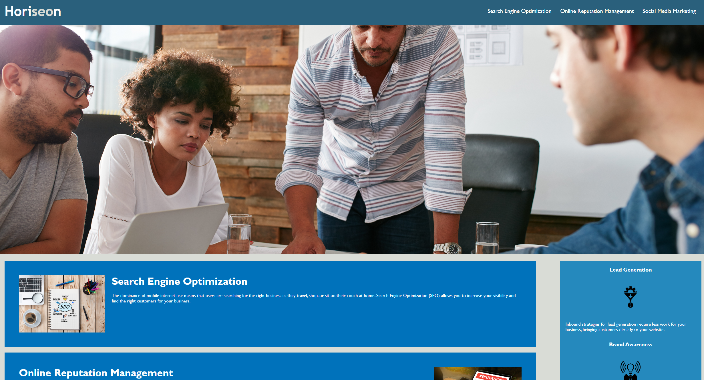

# <Challenge_1>

## Description

 I  worked with this project to apply my knowledge gained durring modual 1, I also used a little from the second modual I learned more about display flex (spicificly with how I orginized the main block of content into two parts) The process of dividing the page really confused me. Now ill be the first to admit I messed up I didnt see the style.css file so I remade it. the code is commented out as I didnt have the heart to delete my work and it helped me understand it, but it wasnt the right task.  Im glad I made this mistake as it helped me develup a further understanding  of modual 1 and a little bit of 2!

## Usage

Link to web page (https://jbird11801.github.io/Challenge_1/)

immage of what you'll see when you click the link 

Simply clink on the link provided to go to the Horiseon main web page this.

## Credits

Reference file contains the promt for the file and a example that I copied from my class repo so as to easly read it as im going. This is the link to where I got the repo off git labs (https://git.bootcampcontent.com/University-of-New-Hampshire/UNH-ViRT-FSF-PT-06-2023-U-LOLC).

 I  used module 0 prework 3.5.3 to make a better read me file (https://courses.bootcampspot.com/courses/3906/pages/3-dot-5-3-create-a-professional-project-readme?module_item_id=885925)

 I also used some definition when commenting from just hovering the mouse over the content in question

## License

Please refer to the LiCENSE in the repo.
